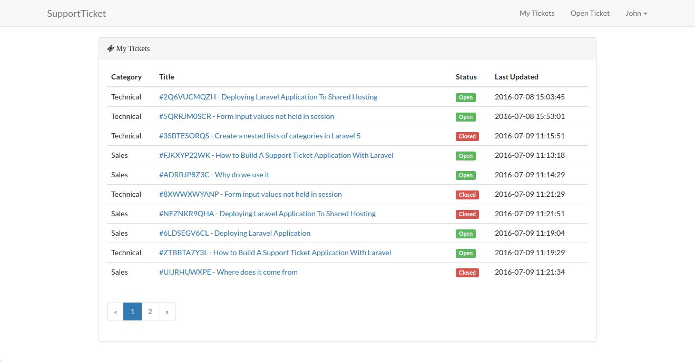

<h1>Support Ticket App</h1>

<h3>Screenshot</h3>

<h3>Commands Used</h3>
<ul>
    <li>php artisan key:generate</li>
    <li>php artisan serve</li>
    <li>php artisan make:auth</li>
    <li>php artisan migrate</li>
    <li>php artisan make:model Ticket/Category -m</li>
    <li>php artisan key:generate</li>
    <li>php artisan tinker</li>
    <li>php artisan make:controller TicketsController</li>
    
</ul>

Part 1 - https://bit.ly/2GE5PNO

Part 2 - https://bit.ly/2GDyypR
